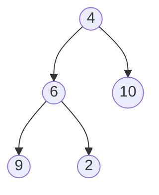
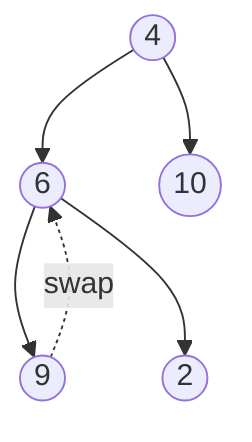
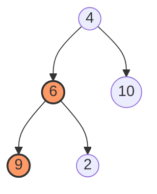
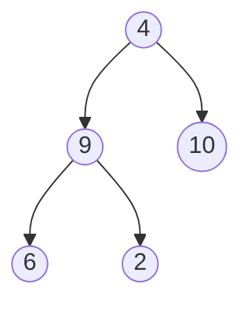
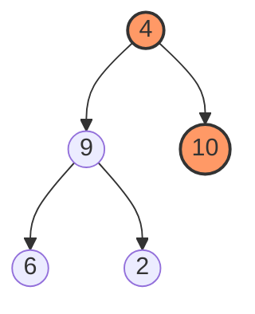
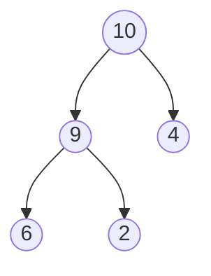

# Heapify Algorithm: Building a Heap

We will do ***Max-Heap*** building.

## 1. Initial Visualization
**Input Array:** `[4, 6, 10, 9, 2]`  
**Total Indices:** 0 to 4 ($n=4$)

---

## 2. Finding the Starting Point

To be efficient, we start from the **last node that has children**. 

**The Formula (0-based):**
$$\text{Start Index} = \frac{n}{2} \text{ (where } n \text{ is the max index)}$$

In our example: $4 / 2 = 2$.

---

## 3. Heapify Process

1. **Compare:** Look at the Parent and its two Children.
2. **Select & Swap:** Select the biggest value among the children and swap with it.
3. **Heapify Down (Ripple Effect):** If you swapped a node downward, check its new children to ensure it still meets the condition. If not, swap again.

Index 2 (value 10) is a *leaf* node  in this specific tree. We move to the next available parent at **Index 1**.

> [!note]
> node with no children is called a *leaf* node. It does not require heapification.

> [!note]
> Regardless of the heap type, the logic remains the same: **The most qualified node moves up.**

## 4. Step-by-Step Example (Max Heap)

### Phase 1: Index 1 (Value: 6)

### Phase 2: Index 0 (Value: 4)

### Final Resulting Max Heap:

`[10, 9, 4, 6, 2]`
* 10 is greater than 9 and 4.
* 9 is greater than 6 and 2.
* **Success!**

> [!important]
> A max-heap or min-heap does not necessarily mean that the arrangement is sorted. It only ensures that the parent-child relationships meet the heap property.

## 5. Summary Table

| Goal | Logic | Action |
| :--- | :--- | :--- |
| **Max Heap** | $Parent \ge Children$ | Swap with **Largest** |
| **Min Heap** | $Parent \le Children$ | Swap with **Smallest** |
| **General** | $Parent = Best$ | Swap with **Most Favorable** |
